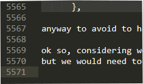
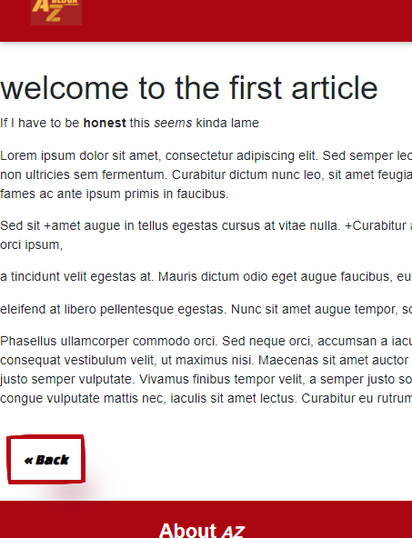

<h1 class="titlo mt-3">
  5571 (part 1)
</h1>

    
    <h3 class="appetize mb-1">
    "It took so long to get the canvas, luckily I already have the brushes with me"
    </h3>

Data has the potencial to be _anything_.
And 5571 lines of data can result in a slight novel, or a Blogk, this _**Blogk**_.

Introduction is about what I got during those 5571 lines, of
design and programming, that I will use for future learnings.

---

**Markup** languages (a branch of computer languages) allow text to be read by both
you and your pc, it uses tags to define text elements.
Here the one used are **_html_** and **_markdown_**

How to Markdown

Markdown (.md extencion file) is an easy to read plan <u>text format</u>.    
it allows a faster stesure , without the needing of traditional <> tags,
with its simpler styling of inline text elements.

### font size 
## can be defined
# by symply adding # at the start of the line

<pre class="codice col-md-10 "> 
### lol which reproduce the html tag &lt;h3&gt; 
## &lt;h2&gt;,
# and &lt;h1&gt; depending on the number of asteriks
</pre>

about the font-style we can get a more **bolder** text or a _more italic one_
<pre class="codice col-md-10"> 
extremily easily just by adding the *asteriks* for an italic one
or **more** for the bold effect and the _italic_

instead of opening and closing the corrispective html tags like &lt;b&gt;asteriks&lt;/b&gt; &lt;i&gt;underling&lt;/i&gt;
</pre>
 

defining **list** is as simple as that too:

- defining the rythimng 
- of the given article
* and mantaining the
+ and the text inside of it is **customizable**

<pre class="codice col-md-7"> 
- just adding one of different symbols
* at the start of the line
+ creates an unordered element of a list
* and different ones create an addition space in-between
* this would be the 
&lt;ul&gt;
  &lt;li&gt; something like this in html &lt;/li&gt;
  &lt;li&gt; with tags opening and closing for each list element &lt;/li&gt;
&lt;/ul&gt;
</pre>

and for ordered list:

1. for first we just get 
5. the same procedure of 
3. the un-ordered list

<pre class="codice col-md-7"> 
1. with just adding the specific number
2. at the start of the line
3. and the number set near indicates its position
&lt;ol&gt;
  &lt;li&gt; expressed changing only the ul (unordered list) tag &lt;/li&gt;
  &lt;li&gt; to the &lt;ol&gt; (ordered list) tag in html&lt;/li&gt;
&lt;/ol&gt;
</pre>
 

for **_links_** there are two different [ways](http://localhost:8080/Introduction/5571) 
the first and more direct:

<pre class="codice col-md-8"> 
[with a stylable title here and](https://a_plain_link_here.com)
</pre>

a _reference_ mode is also [avaiable][linked].

[linked]: https://i.kym-cdn.com/photos/images/original/001/378/030/d4b.jpg 
<pre class="codice col-md-8"> 
differes from the last one because both 
[the title][the reference] are in square brakets
while the real link has to be paired up with the referece and a :

[the reference]:(https://it_is_invisible_from_the_main_view.com)
</pre>

in both examples the title in can be <u>freely styled</u>.

the simples way to set up a plain link is with a pair of < >
<https://getbootstrap.com/>
<pre class="codice col-md-10"> 
  &lt;https://getbootstrap.com&gt;
  in html would have been:

  &lt;a href=&quot;https://getbootstrap.com/&quot;&gt;plain title &lt;/a&gt;
  tag valid in the past examples.
</pre>
 

**_Images_** also have a simply way to put them in:

<pre class="codice col-md-10"> 
its the same as links but with an exclamation tag

which is the equivalent of:
&lt;img href=&quot;../../assets/snow.jpg&quot;&gt;alt&lt;/img&gt;
on html.
</pre>

___

Time for the html

_Html_ is the principal <u>computer language</u> used to build web pages, tags can sometimes intralciare the readibility 
but the use of _classes_ within allow _css_ to **_style_** and position layout elements.

Htlm tags also offer some unique effects like the
 sub tags  and the  **sup tags** 

<pre class="codice col-md-10"> 
&lt;sub&gt; sub tags &lt;/sub&gt; or &lt;sup&gt; sup tags &lt;/sup&gt;
</pre>

or the <mark>highlight</mark> of specific text areas
<pre class="codice col-md-10"> 
&lt;mark&gt;with a standard white effect&lt;/mark&gt;
</pre>

to mantain a certain _rhythm_ during the article 
I would use the use html <u>summary tags</u>
to cut some exposition that may not be essential for all readers.

  
something you may or may not already know.

  
 -its good to keep the number of lines down and try to save 
      space for the important data>
    

    
 

In case of smaller details I can 
<abbr title="did you hover me?"> do this </abbr>

<pre class="codice col-md-10"> 
  &lt;abbr title=&quot;did you hover me?&quot;&gt; the title are the details&lt;/abbr&gt;
</pre>

Html also allows me to set up an **_audio console_** if necessary for the argument treated.   

<audio controls>
  <source src="../../assets/mona.mp3" type="audio/mp3">
  this happears only if source fails
</audio>

<!---->
<!---->

untill now I showed data but thats not enought to set a layout.
For that the rules of display are needed

-this is the inline sentence

-meanwhile this is the    
block displayed one

<pre class="codice col-md-10"> 
-this is the
 inline sentence

-meanwhile this is the

block displayed one

</pre>

as you see the _break line_ is valid in one sentence and not in the other.    
**Block** level and **inline** level elements differ on how they mangage the **width** of the page
and aren't limited to the &lt;div&gt; and &lt;span&gt; tag ( the &lt;img&gt; and &lt;a&gt; tag are **inline** too).

<pre class="codice col-md-8"> 
which can be implemented in the css file with the property display.
.lined{
  display: inline;
}
.spaced{
  display: block;
}

Doing both tag and css class can be an overkill thought.
</pre>

this is not easily done in Markdown which display is mostly inline.

___

why do this work?

How can I use 2 different <u>computer languages</u> under a single file format (.md)?
The Markdown file format _allows_ <u>html code </u> and is able to <u>detect and process</u> it each time it gets used,
this great **synergy** is not very common between languages, not even the markup ones. 

So,

why using 2 similar languages and not just Markdown then?

The early stages of the **_Blogk_** had Markdown as the default option, considering its <u>speed and efficience</u> in showing plain text.

But more and more, during the development progress, Markdown's <u>lack of spacing and styling options</u>
(due also to the limitation in my built-in Markdown version),
caused the layout to not provide a _satifactory_ reading experience. 
My articles seem like bland and unfinished content within the **Blogk**.   
Thats why at the end I opted for an _hybrid_ option, which offered **layout** possibilities and _fast typing_.

  
When I refer to layout I refer to the background and text font   
    
  
 and also to the position of any image present here, which has its own template of css properties
      so I dont have to re code each time I have to post an image, as do the titles.
  

 

Displaying **code** in any markup file tends not to be easy, considering that it gets 
immediatly "translated" in text without showing any tag or the internal structure.
Both languages had solutions but the Markdown's one was too<abbr title="specific on the code to show"> specific </abbr>
so here you can see the one that works for me.

  
A text convertor could come in handy 

  
-to be more precise the textFX plug in the text editot
  (in my case Notepad++).
  to then TextFx-> convert -> encode_Html
  

<pre class="codice col-md-10"> 
  &lt;pre class=&quot;codice col-md-10&quot;&gt; 
    the col-md-10 is just to regulate the width of the space for the code, while the 'codice'
    class helps us use the same css properties for all the code intances.
  &lt;/pre&gt;
</pre>
 

